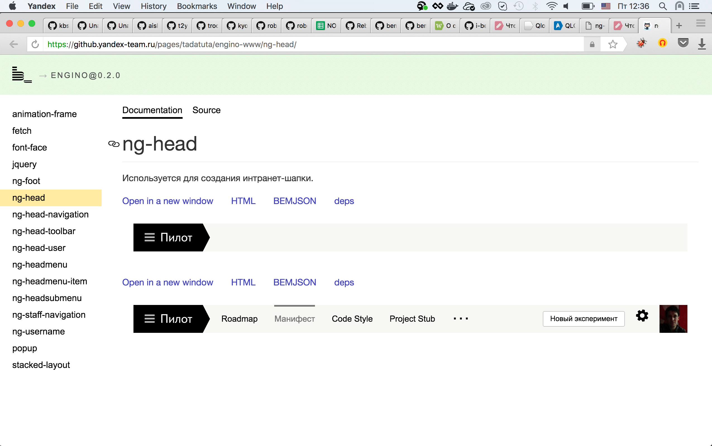

---

layout: default

---

# Яндекс

## **{{ site.presentation.title }}** {#cover}

    
{{ site.presentation.service }}





	
{{ site.author.name }},   {{ site.author.position }}

## ****

## **Документация — это хорошо**

## **Автогенерируемая документация — лучше!**

## **Что есть**

## Что было
* Сайт внутренней библиотеки Яндекса
* ...[bem.info](https://ru.bem.info/libs/bem-components/v2.4.0/showcase/)
* ...[bem-site-engine](https://github.com/bem/bem-site-engine/)

## Что еще было
* [bem-site](https://github.com/bem-site)
* ...bem-data-source
* ...provider
* ...bse-admin
* ...mds-wrapper
* ...builder-libraries
* ...snapshot-master

## Что еще было
* builder-sitemap-xml
* ...dependency-updater
* ...snapshot-cleaner
* ...bem-md-renderer
* ...и так далее...

## ****

## **Что появилось**

## **[bem-lib-site](https://github.com/bem-site/bem-lib-site)**

## **Как устроено**

## Как устроено
* bem-lib-site
    * ...bem-lib-site-data
    * ...bem-lib-site-view

## bem-lib-site-data
* Ставит зависимости
* ...Собирает интроспекцию о всех БЭМ-сущностях
    * ...Пути к исходным файлам блоков со всех уровней
    * ...Пути к кастомным файлам примеров

## bem-lib-site-data
* Ставит зависимости
* Собирает интроспекцию о всех БЭМ-сущностях
* Собирает документацию
    * ...block.{lang}.md (с учетом инлайновых примеров)
    * ...JSDoc

## bem-lib-site-data
* Ставит зависимости
* Собирает интроспекцию о всех БЭМ-сущностях
* Собирает документацию
* Собирает примеры
    * ...Живые, в iframe
    * ...HTML
    * ...BEMJSON
    * ...deps

## bem-lib-site-data
* Ставит зависимости
* Собирает интроспекцию о всех БЭМ-сущностях
* Собирает документацию
* Собирает примеры
* Общие readme, migration, changelog
* ...На выходе JSON и файлы примеров

## Структура данных
~~~
library
    version
        gh: '',
        readme: '',
        changelog: ''
        migration: ''
        sets
            desktop
                button
                    docs: ''
                    jsdoc: ''
                    examples: ''
                    sources: ''
~~~

## bem-lib-site-view
* Типичный БЭМ-проект
* ...Можно использовать как уровень переопределения
* ...Можно запилить свой
* ...На вход результат работы bem-lib-site-data
* ...На выходе статичный сайт

## ****

## **Как использовать**

## Как использовать
~~~
npm i bem-lib-site
~~~

## Как использовать
~~~
npm i bem-lib-site
bem-lib-site path/to/my/lib
~~~

## ****

## Как использовать
~~~
blocks/
    button/
        button.js
        button.bemhtml.js
    input/
    ...
~~~

## Как использовать
~~~
blocks/
    button/
        button.md
        button.js
        button.bemhtml.js
    input/
    ...
~~~

## **[button.md](https://github.com/bem/bem-components/blob/v3/common.blocks/button/button.ru.md)**

## **[bem.info](https://ru.bem.info/libs/bem-components/v2.4.0/showcase/)**

## Конфигурация
~~~
'bem-lib-site-data': {
    tempFolder: 'tmp',
    outputFolder: 'output',
    platforms: { desktop: ['common', 'deskpad', 'desktop'] },
    libs: {
        'bem-components': {
            langs: ['ru', 'en'],
            github: {
                url: 'github.com', user: 'bem', repo: 'bem-components', defaultBranch: 'v3'
            }
        }
    }
}
~~~

## Планы на будущее
* Внедрить в bem.info
* ...Поддержать инкрементальную сборку
* ...Написать тестов, наконец!

## **Ваши вопросы!**

## ****

## **Контакты** {#contacts}

{{ site.author.name }}

{{ site.author.position }}

    

        
bem.info

        
info@bem.info

        
bem_ru #b_

        <!-- 
vk
 -->
        <!-- 
facebook
 -->
    

